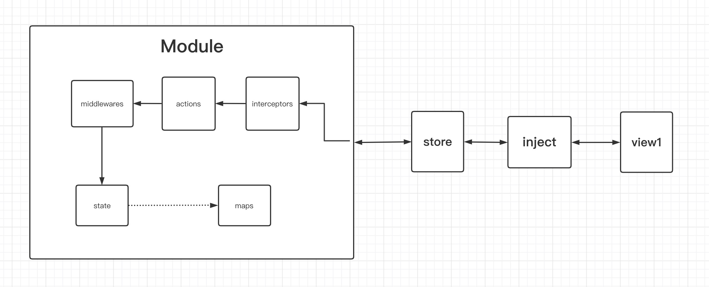
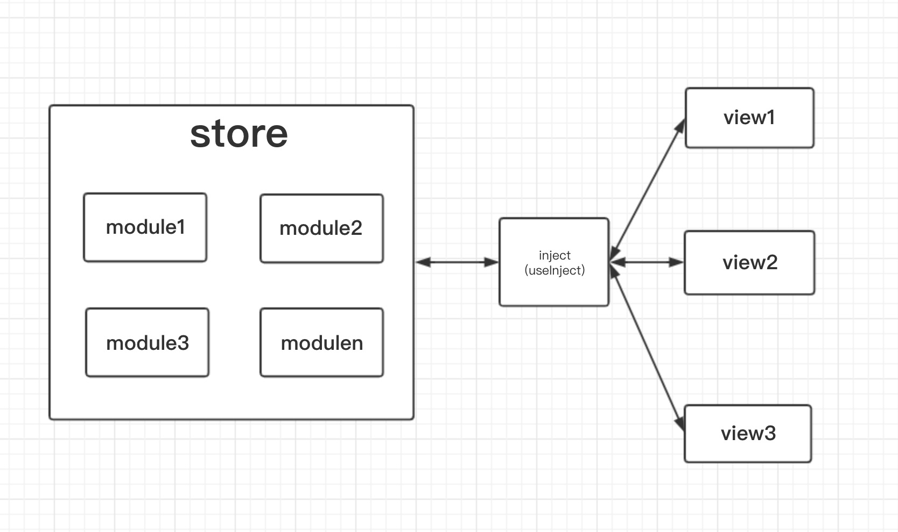

# natur cook book


## introduction
1. This is a simple and efficient react state manager
1. Good typescript experience
1. Unit test coverage rate of 99%, rest assured to use
1. minizipped size 5k
1. if your enviroment is react@17 or lower, you can use natur@2.1.x

## start

1. open your react project
1. install **natur**
  ```bash
  # npm install natur -S
  yarn add natur
  ```
## design

### the flow of a store module




### store module management

**natur itself is a module manager, plus publish and subscribe**




## simple demo

[codesandbox](https://codesandbox.io/s/natur-2x-simple-demo-nx0pp?file=/src/App.tsx)
### declare a module

```tsx
const count = {
  // save data
  state: {
    number: 0,
  },
  // map of state
  maps: { 
    isEven: ['number', number => number % 2 === 0],
  },
  // actions is used to update state
  actions: { 
    inc: number => ({number: number + 1}),
    dec: number => ({number: number - 1}),
  }
}
```

### create store and inject

```ts
import { createStore, createUseInject } from 'natur';

const store = createStore({count}, {});
const useInject = createUseInject(() => store);
const useFlatInject = createUseInject(() => store, {flat: true});
```
### use in React
```tsx
// create an injector of count module

// declare props type
const App = () => {
  const [count] = useInject('count');
  const [flatCount] = useFlatInject('count');
  // The data in flatCount is flat, that is, the data in state, action, and maps are put into one object (state data will be overwritten by maps, please pay attention to naming)

  return (
    <>
      <button onClick={() => count.actions.dec(count.state.number)}>-</button>
      <span>{count.state.number}</span>
      <button onClick={() => count.actions.inc(count.state.number)}>+</button>
      <span>{count.maps.isEven}</span>
    </>
  )
};

// render injected component
ReactDOM.render(<App />, document.querySelector('#app'));
```


## detailed module

**A module consists of state, maps, actions**

### state — Storing Data


- **required:**`true`
- **type:**`any`
- state is used to store data

### maps — Computed Properties


- **required:**`false`
- **type:**`{[map: string]: Array<string|Function> | Function;}`

- maps is a map of state data, and its member must be an array of function. Let's call it map for now.
- if the map is an array, the preceding elements are all declaring the dependency of this map on the state. The last function can get the dependency declared earlier, and you can implement the calculation logic you need in it. On the component, you can get the result of the last function of the array.
- if the map is a function, then it can only accept state as an input parameter, or there is no parameter. If it is a state as a parameter, then when the state is updated, the map must be re-executed and there is no cache. If the map has no parameters, then this map will only be executed once
- the results of maps are cached. If the value of the dependencies you declare does not change, the last function will not be re-executed.
- When do I need to manually declare dependencies? If your map logic is more complicated, or the return value of your map is not a basic type value and needs to be rendered to the component, then you can consider manually declaring dependencies to ensure performance. Generally, you can use the function directly.

```ts
const demo = {
  state: {
    number: 1,
    value: 2,
  },
  maps: {
    // The elements in front of the array are all declaring the dependency of this map on state. The last function can get the previously declared dependencies. You can implement what you want in it.
    sum1: ['number', 'value', (number, value) => number + value],
    // You can also declare dependencies as functions, which is useful for complex types of state
    sum2: [state => state.number, s => s.value, (number, value) => number + value],
    // It can also be a function that directly depends on the entire state. The disadvantage is that the function will be re-executed as long as the state is updated, and there is no cache.
    sum3: ({number, value}) => number + value,
    // It can also be a function, no dependencies, only executed once
    isTrue: () => true,
  },
}

/**
 * the demo module data you got at component is
 * demo: {
 *  state: {
 *    number: 1,
 *    value: 2,
 *  }
 *  maps: {
 *    sum1: 3,
 *    sum2: 3,
 *    sum3: 3,
 *    isTrue: true
 *  }
 * ...
 * }
 */
```

### actions — Updating Data


- **required:**`true`
- **type:**`{[action: string]: (...arg: any[]) => any;}`
- The member of actions must be functions. If no middleware is set, any data it returns will be used as the new state, and the react components using this module will be notified to update, which is done inside natur.
- actions must follow the immutable specification!

```ts
type Actions = {
  [action: string]: (...arg: any[]) => any;
}

const demo = {
  state: {
    number: 1,
  },
  // Actions are used to modify the state. The data it returns will be used as the new state (this part is done internally by natur)
  actions: { 
    inc: number => ({number: number + 1}),
    dec: number => ({number: number - 1}),
  }
}
```


### watch — watch any change of modules

- **required:**`false`
- **type:**`{[moduleName: string]: (event: WatchEvent, api: WatchAPI) => void;} | (event: AllModuleEvent, api: WatchAPI) => void;`
- watch can monitor the changes of a certain module, or the changes of all modules
- in the watch, you can get the state and maps of the current module, and you can also call localDispatch to call the action of this module

```ts
const demo = {
  state: {
    number: 1,
  },
  actions: { 
    inc: number => ({number: number + 1}),
    dec: number => ({number: number - 1}),
  },
  watch: {
    moduleA: (event: ModuleEvent, api: WatchAPI) => {
      // any change of moduleA will trigger this function, and the specific change information can be obtained in the event parameter
      // for example, the initialization, state update, and destruction of moduleA can all be monitored
      // the api parameter includes APIs such as getState, getMaps, localDispatch of the demo module, and getStoreAPI for obtaining the global store.
      // localDispatch can only call the action of demo module, for example: localDispatch('inc', 2);
    }
  }
}

const moduleA = {
  state: {
    number: 1,
  },
  actions: { 
    inc1: number => ({number: number + 1}),
    dec1: number => ({number: number - 1}),
  },
  // watch can also be a function to monitor the changes of all modules
  watch: (event: AllModuleEvent, api: WatchAPI) => { 
      // any module change will trigger this function, including the moduleA module itself, and the specific change information can be obtained in the event parameter
      // the api parameter includes APIs such as getState, getMaps, localDispatch of the moduleA module, and getStoreAPI for obtaining the global store.
      // localDispatch can only call the action of moduleA module, for example: localDispatch('inc1', 2);
    }
}

```


## usecase


### inject multiple modules

```ts
// import your inject function you created. for details, please refer to the simple demo above
import useInject from 'your-use-inject';

// in your component
const [module1] = useInject('module1');
const [module2] = useInject('module2');
// ...

```

### synchronous update data

- here we use the [officially recommended middleware configuration](#recommended-middleware-configuration) by default, please see the middleware section for details

```ts
const app = {
  state: {
    name: "tom",
  },
  actions: {
    // here is the synchronous update of the name data in the state
    changeName: newName => ({ name: newName }),
  }
};
```

### asynchronous update data

- here we use the [officially recommended middleware configuration](#recommended-middleware-configuration) by default, please see the middleware section for details

```ts
const app = {
  state: {
    name: "tom",
  },
  actions: {
    // here is the asynchronous update of the name data in the state
    changeName: newName => Promise.resolve({ name: newName }),
  }
};
```
### update data asynchronously in multiple batches

- here we use the [officially recommended middleware configuration](#recommended-middleware-configuration) by default, please see the middleware section for details

```ts
import { ThunkParams } from "natur/dist/middlewares";

const state = {
  now: Date.now(),
}
const actions = {
  // here is the asynchronous multi-batch update of the name data in the state
  updateNow: () => ({setState}: ThunkParams<typeof state>) => {
    // update the value of now every second
    setInterval(() => setState({now: Date.now()}), 1000);
  },
}

const app = {
  state,
  actions
};
```


### get the latest state and maps value in actions

- here we use the [officially recommended middleware configuration](#recommended-middleware-configuration) by default, please see the middleware section for details

```ts
import { ThunkParams } from "natur/dist/middlewares";

const state = {
  name: 'tom',
}
const maps = {
  nameIsTome: ['name', (name: string) => name === 'tom'],
}

const actions = {
  updateName: () => ({getState, getMaps}: ThunkParams<typeof state, typeof maps>) => {
    // get the latest state value
    const currentState = getState();
    // get the latest maps value
    const currentMaps = getMaps();
  },
}

const app = {
  state,
  maps,
  actions
};
```


### call other actions in actions

- here we use the [officially recommended middleware configuration](#recommended-middleware-configuration) by default, please see the middleware section for details

```ts
import { ThunkParams } from "natur/dist/middlewares";

const state = {
  name: 'tom',
  loading: true,
}

const actions = {
  loading: (loading: boolean) => ({loading}),
  // This is the action that calls loading
  fetchData: (newName: string) => async ({localDispatch}: ThunkParams) => {
    // call loading method
    localDispatch('loading', true);
    // you can also call actions of other modules, but it is not recommended to use them widely
    await new Promise(resolve => setTimeout(resolve, 3000));
    localDispatch('loading', false);
    return {name: newName};
  },
}

const app = {
  state,
  actions
};
```


### the component only listens to changes in some data

```tsx
// import your inject function you created. for details, please refer to the simple demo above
import useInject from 'your-use-inject';

// Here the App component will only listen to changes in the name of the app and state. Changes in other values will not cause updates to the App component
const [app] = useInject('app', {
  state: ['name'], // You can also use function declarations state: [s => s.name]
});

// Here the App component only listens to changes in the app and the map's deepDep. Changes in other values will not cause updates to the App component
const [app] = useInject('app', {
  maps: ['deepDep'], 
}); 

// Here the App component will not be updated regardless of any changes in the app module
const [app] = useInject('app', {});

// Because actions stay the same after they are created, you don't have to listen for changes
const App = () => {
  // get app module
  const [app] = useInject('app');
  return (
    <input
      value={state.name} // state in app
      onChange={e => actions.changeName(e.target.value)}
    />
  )
};

```  

---

### lazy loading module configuration

```ts
/*
  module1.js
  export {
    state: {
      count: 1,
    }
    actions: {
      inc: state => ({count: state.count + 1}),
    }
  }
  
*/
const otherLazyModules = {
  // module2: () => import('module2');
  // ...
}
const module1 = () => import('module1'); // Lazy loading module

// Create a store instance
// The second parameter is the lazy loaded module;
const store = createStore(
  { app }, 
  { module1, ...otherLazyModules }
);

// Then the usage is equivalent to the second step
```


### initialization state

```tsx
import { createStore } from 'natur';
const app = {
  state: {
    name: 'tom',
  },
  actions: {
    changeName: newName => ({ name: newName }),
    asyncChangeName: newName => Promise.resolve({ name: newName }),
  },
};
/*
  createStore third parameter
  {
    [moduleName: ModuleName]: Require<State>,
  }
*/
const store = createStore(
  { app }, 
  {},
);


store.globalSetStates({
  app: {name: 'jerry'} // apply the state of the app module
})

export default store;
```


### complex business scenarios of cross-module interaction

> you can use watch prop of module, to listen any changes of other module, and dispatch any action you want

```ts
import { ModuleEvent, AllModuleEvent, WatchAPI } from 'natur';

export const moduleA = {
    state: {},
    actions: {/* ... */},
    watch: {
        moduleB(event: ModuleEvent, api: WatchAPI) {
          // any update of moduleB will trigger this function
          // event have any data of this change
          // api contain, getState, getMaps, localDispatch APIs of this module, and getStore API.
          // localDispatch can only call action in this module, for example: localDispatch('actionNameA', ...actionAArgs);
        }
    }
}
export const moduleB = {
    state: {},
    actions: {/* ... */},
    // watch also can be a function to watch all module of store
    watch: (event: AllModuleEvent, api: WatchAPI) => { 
      // any update of any module will trigger this function
      // event have any data of this change
      // api contain, getState, getMaps, localDispatch APIs of this module, and getStore API.
      // localDispatch can only call action in this module, for example: localDispatch('actionNameA', ...actionAArgs);
    }
}
```
---


### placeholder component configuration when loading

```tsx
import { createInject } from 'natur';
// Global configuration
const inject = createInject({
  storeGetter: () => store,
  loadingComponent: () => <div>loading...</div>,
})
// Local use
inject('app')(App, () => <div>loading</div>);
```


### use natur outside react

```ts
// Store instance created before
import store from 'my-store-instance';

/*
  Get the registered app module, which is equivalent to the app module obtained in the react component
  If you want to get lazy loaded modules,
  Then you have to make sure that the module is already loaded at this time
*/
const app = store.getModule('app');
/*
  If you are sure, lazy load the module, not loaded yet
  You can listen for lazy loading modules and get
*/
store.subscribe('lazyModuleName', () => {
  const lazyModule = store.getModule('lazyModuleName');
});

/*
state: {
  name: 'tom'
},
actions: {
  changeName,
  asyncChangeName,
},
maps: {
  splitName: ['t', 'o', 'm'],
  addName: lastName => state.name + lastName,
}
*/
/*
  When you use the action method to update the state here,
  All components injected into the app module will be updated,
  And get the data in the latest app module,
  Advised not to abuse
*/
app.actions.changeName('jerry');
// Equivalent to
store.dispatch('app', 'changeName', 'jerry');

// Monitoring module changes
const unsubscribe = store.subscribe('app', () => {
  // Here you can get the latest app data
  store.getModule('app');
});


// Cancel listening
unsubscribe();
```


### dispatch

```typescript
import { createStore, inject, InjectStoreModule } from 'natur';

const count = {
  state: {
    number: 0,
  },
  maps: {
    isEven: ['number', number => number % 2 === 0],
  },
  actions: {
    inc: number => ({number: number + 1}),
    dec: number => ({number: number - 1}),
  }
}

const store = createStore({count}, {});

const {actions, state} = store.getModule('count')

actions.inc(state.number);
// Equivalent to
store.dispatch('count', 'inc', state.number);
```

### importing modules manually

```ts

// initStore.ts
import { createStore } from 'natur';

// When instantiating the store, no lazy loading module was imported
export default createStore({/*...modules*/}, {});

// ================================================
// lazyloadPage.ts This is a lazy loaded page
import store from 'initStore.ts'

const lazyLoadModule = {
  state: {
    name: 'tom',
  },
  actions: {
    changeName: newName => ({ name: newName }),
  },
  maps: {
    nameSplit: state => state.name.split(''),
    addName: state => lastName => state.name + lastName,
  },
};
/*
Add the module manually, it cannot be used anywhere else until it is added
To use it elsewhere, it must be imported when the store is instantiated
*/
store.setModule('lazyModuleName', lazyLoadModule);

const lazyLoadView = () => {
  // Now you can get manually added modules
  const {state, maps, actions} = store.getModule('lazyModuleName');
  return (
    <div>{state.name}</div>
  )
}
```


## interceptor

**When the module calls action or store.dispatch, it will pass the interceptor first, so the interceptor can be applied to control whether the action is executed, and the input parameter control of the action**

```tsx

import {
  createStore,
  Interceptor
  InterceptorActionRecord,
  InterceptorNext,
  InterceptorParams,
} from 'natur';

const app = {
  state: {
    name: 'tom',
  },
  actions: {
    changeName: newName => ({ name: newName }),
    asyncChangeName: newName => Promise.resolve({ name: newName }),
  },
};

type InterceptorActionRecord = {
  moduleName: String;
  actionName: String;
  actionArgs: any[];
  actionFunc: (...arg: any) => any; // The original action function
}

type InterceptorNext = (record: InterceptorActionRecord) => ReturnType<Action>;

// The InterceptorParams type is the same as the MiddlewareParams type

type InterceptorParams = {
  setState: MiddlewareNext, 
  getState: () => State,
  getMaps: () => InjectMaps,
  dispatch: (action, ...arg: any[]) => ReturnType<Action>,
};

const LogInterceptor: Interceptor<typeof store.type> = (interceptorParams) => 
  (next: InterceptorNext) => 
    (record: InterceptorActionRecord) => {
    console.log(`${record.moduleName}: ${record.actionName}`, record.actionArgs);
    // You should return
    // only then will you have the return value when you call the action on the page
    return next(record);
};
const store = createStore(
  { app }, 
  {},
  {
    interceptors: [LogInterceptor, /* ...moreInterceptor */]
  }
);

export default store;
```

## middleware
**The execution of the middleware occurs after the action is executed and before the state is updated. Can receive the return value of the action, generally can be applied to the processing of the return value of the action, the control of state update, etc.**
```tsx
import { createStore, MiddleWare, MiddlewareNext, MiddlewareActionRecord } from 'natur';
const app = {
  state: {
    name: 'tom',
  },
  actions: {
    changeName: newName => ({ name: newName }),
    asyncChangeName: newName => Promise.resolve({ name: newName }),
  },
};

type MiddlewareActionRecord = {
  moduleName: String,
  actionName: String,
  state: ReturnType<Action>,
}

type MiddlewareNext = (record: MiddlewareActionRecord) => ReturnType<Action>;

type MiddlewareParams = {
  setState: MiddlewareNext, 
  getState: () => State,
  getMaps: () => InjectMaps,
  dispatch: (action, ...arg: any[]) => ReturnType<Action>,
};

const LogMiddleware: MiddleWare<typeof store.type> = (middlewareParams) => 
  (next: MiddlewareNext) => 
    (record: MiddlewareActionRecord) => {
    console.log(`${record.moduleName}: ${record.actionName}`, record.state);
    return next(record); // You should return, only then will you have a return value when the page calls the action
    // return middlewareParams.setState(record); // You should return, only then will you have a return value when the page calls the action
const store = createStore(
  { app }, 
  {},
  {
    middlewares:[LogMiddleware, /* ...moreMiddleware */]
  },
  
);

export default store;
```

### built-in middleware description

- thunkMiddleware: The thunk middleware allows actions to return functions, and has enhanced functions such as obtaining the latest state, maps, and setState, dispatch, etc.

**If you like mutable writing, [natur-immer](/natur-immer) is recommended**


```ts
import { thunkMiddleware, ThunkParams } from 'natur/dist/middlewares'

const actionExample = (myParams: any) => ({
  getState, 
  setState, 
  getMaps,
  dispatch,
}: ThunkParams<typeof stateOfThisModule, typeof mapsOfThisModule>) => {
  const currentState = getState(); // get latest state
  const currentMaps = getMaps(); // get latest maps
  // dispatch('otherActionNameOfThisModule', ...params)
  // dispatch('otherModuleName/otherActionNameOfOtherModule', ...params);
  setState(currentState); // update state
  return currentState; // update state too
}
```

- promiseMiddleware: action supports asynchronous operations
```typescript
const action1 = () => Promise.resolve(2333);
const action2 = async () => await new Promise(res => res(2333));
```

- fillObjectRestDataMiddleware: Incremental state update / overwrite update, only valid when state is an object
```typescript

const state = {a: 1, b:2};
const action = () => ({a: 11})// Call this action, the final state is {a: 11, b: 2}, this middleware requires that the data returned by the state and action must be ordinary objects
```


- shallowEqualMiddleware：Shallow comparison optimization middleware, limited to the state of ordinary objects
```typescript

const state = {a: 1, b:2};
const action = () => ({a: 1, b:2}) // Same as the old state, do not update the view
```

- filterUndefinedMiddleware: Interceptor actions that return undefined
```typescript
const action = () => undefined; // The return of this action will not be used as the new state
```


- devtool

```typescript

// redux.devtool.middleware.ts
import { Middleware } from 'natur';
import { createStore } from 'redux';

const root = (state: Object = {}, actions: any):Object => ({
  ...state,
  ...actions.state,
});

const createMiddleware = ():Middleware => {
  if (process.env.NODE_ENV === 'development' && (window as any).__REDUX_DEVTOOLS_EXTENSION__) {
    const devMiddleware = (window as any).__REDUX_DEVTOOLS_EXTENSION__();
    const store = createStore(root, devMiddleware);
    return ({getState}) => next => record => {
      store.dispatch({
        type: `${record.moduleName}/${record.actionName}`,
        state: {
          [record.moduleName]: record.state || getState(),
        },
      });
      return next(record);
    }
  }
  return () => next => record => next(record);
}

export default createMiddleware();
```

### recommended middleware configuration

**Note: The order of middleware configuration is important**

```typescript
import {createStore} from 'natur';
import { 
  thunkMiddleware,
  promiseMiddleware, 
  fillObjectRestDataMiddleware,
  shallowEqualMiddleware, 
  filterUndefinedMiddleware,
} from 'natur/dist/middlewares';
import devTool from 'redux.devtool.middleware';

const store = createStore(
  modules,
  {},
  {
    middlewares: [
      thunkMiddleware, // Action supports returning functions and getting the latest data
      promiseMiddleware, // action supports asynchronous operations
      fillObjectRestDataMiddleware, // Incremental state update / overwrite update
      shallowEqualMiddleware, // Shallow contrast optimization between old and new state
      filterUndefinedMiddleware, // Interceptor actions with no return value
      devTool,
    ]
  },
);
```


## typescript support

### base usage
```ts
import React from 'react';
import ReactDOM from 'react-dom';
// import your inject function you created. for details, please refer to the simple demo above
import inject from 'your-inject'
import {ModuleType} from 'natur';

const count = {
  state: { // 存放数据
    number: 0,
  },
  maps: { // state的映射。比如，我需要知道state中的number是否是偶数
    isEven: ['number', number => number % 2 === 0],
  },
  actions: { // 用来修改state。返回的数据会作为新的state(这部分由natur内部完成)
    inc: number => ({number: number + 1}),
    dec: number => ({number: number - 1}),
  }
}

// Generate the type obtained by the count module in the component
type InjectCountType = ModuleType<typeof count>;

const injector = inject('count');

type otherProps = {
  className: string,
  style: Object,
}

const App: React.FC<typeof injector.type & otherProps> = (props) => {
  const {state, actions, maps} = props.count;
  return (
    <>
      <button onClick={() => actions.inc(state)}>+</button>
      <span>{state.count}</span>
      <button onClick={() => actions.dec(state)}>-</button>
    </>
  )
}

const IApp = injector(App);

const app = (
  <IApp className='1' style={{}} />
);
ReactDOM.render(
  app,
  document.querySelector('#app')
);
```


### Redefine store type

```ts
import {Store, createStore} from 'natur';

const count = {
  /* ... */
}

const lazyModule1 = () => import(/* ... */);

const allSyncModules = {
  count,
  /* and others */
}
const allAsyncModules = {
  lazyModule1,
  /* and others */
}

const store = createStore(allSyncModules, allAsyncModules);

type StoreInsType = Store<typeof allSyncModules, typeof allAsyncModules>;

// The type of StoreInsType is the type of store, you can extend your type
```

## why choose NATUR

### system design concept

1. The original intention of `natur` is to manage all the business logic in the project in a simple and natural way. In this respect, it is different from [redux](https://redux.js.org/) or [mobx](https://mobx.js.org/README.html) such a state management library. `natur` can easily make all the business in the project and the `UI` layer loosely coupled, which can keep the `UI` sufficiently simple and pure, which is of great benefit to the maintainability of the project.
1. The `state` of the module contains the storage of business data. `maps` contains the logic of `state` derived data, and the design of the cache to ensure performance. It is worth mentioning that `maps` uses a manual method of declaring dependencies, which is also consistent with the consistent design style of `react` . The `action` contains the update of the `state` data and other business logic (such as an API call without a return value). `natur` recommends that the responsibility of the `action` design is clear, and an `action` only does one thing. If the execution of each `action` can have corresponding `state` changes, then this can make the entire project observable and traceable, and can better serve the communication between modules (observability and traceability can be passed through [interceptor](#interceptor) and [middleware](#middleware) to achieve).
1. In module communication, [watch](/natur/#watch-watch-any-change-of-modules) can effectively monitor module actions and decouple dependencies between modules.
1. In the design of the `natur` module, it is recommended that users subdivide the modules, clarify the boundaries and granularity of the modules to ensure the maintainability of the modules. Make sure that a `natur` module only deals with its own business, and does not need to care about other modules, and is not coupled with other modules.
1. Because the creation and use of `natur` module is simple enough, so that the development can be as simple and natural as possible to write projects that conform to the design concept of `natur`. Of course, the most important thing is that developers need to understand `natur. `The design philosophy and follow it.

### Compared with redux

1. First of all [redux](https://redux.js.org/) is a global state manager, which is different from the design goal of `natur`'s project business logic management.
1. Secondly, the cost of using [redux](https://redux.js.org/) is relatively high, while the use of `natur` is very simple
1. In terms of performance, there is support for caching, [module lazy loading](#lazy-loading-module-configuration), and [partial monitoring function](#the-component-only-listens-to-changes-in-some-data) in `natur`, you don’t need additional Library to ensure the performance of your project.

### Comparison with mobx

1. In terms of compatibility, because [mobx](https://mobx.js.org/README.html) uses `proxy` or `defineProperty` and other `API`, the compatibility is slightly worse
1. In terms of module communication, mobx's design cannot be perfectly coupled, which is a pity
1. In terms of performance, the cache performance optimization of `mobx` relies on `immutable` so it is better than `natur` in terms of user-friendliness, but `natur` also has [module lazy loading](#lazy-loading-module-configuration). Function better than `mobx`

## cautions

 - Because the lower version does not support the react.forwardRef method, you cannot directly use the ref to obtain the wrapped component instance. You need to use the forwardedRef property to obtain it (the usage is the same as ref).

 - Tips in TypeScript may be less friendly, like
 ```ts
@inject('count', 'name')
class App extends React.Component {
  // ...
}

// This usage method will report an error, indicating that there is no forwardedRef attribute declaration in the App component
<App forwardedRef={console.log} />

// The following usage methods will not report an error
class _App extends React.Component {
  // ...
}
const App = inject('count', 'name')(_App);
// correct
<App forwardedRef={console.log} />
 ```
- **To modify state in actions, you need to follow the immutable specification**


## plugins

- [natur-persist: localStorage plugins](/natur-persist)
- [natur-persist-async: async presit plugin](/natur-persist-async)
- [natur-immer: immer middleware](/natur-immer)
- [umi-natur: umi plugin of natur](/umi-natur)
