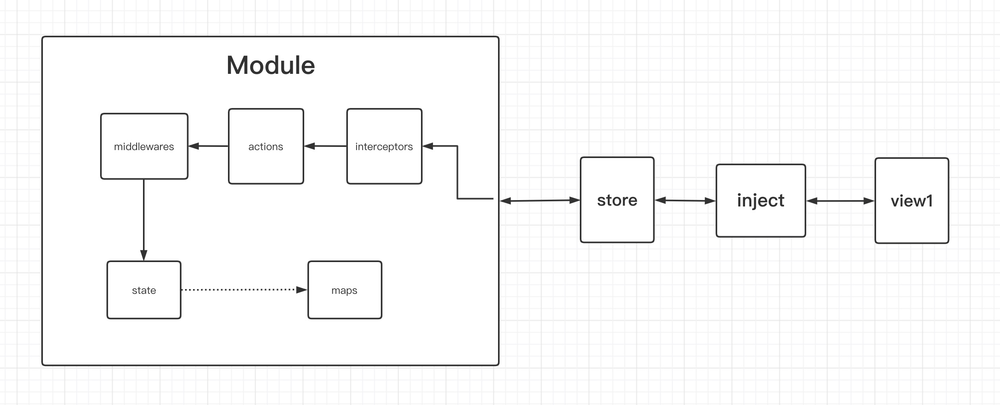

# natur 使用手册

## 基本介绍

1. 这是一个简洁、高效的react状态管理器
1. 良好的typescript体验
1. 浏览器兼容：IE8+
1. 支持react, 以及anujs
1. 单元测试覆盖率99％，放心使用
1. 包体积，minizip 5k(uglify+gzip压缩后5k)


## 起步

1. 打开你的react项目
1. 安装```natur```
  ```bash
  yarn add natur
  # npm install natur -S
  ```

## 设计

### 模块流程




### 模块管理

**natur本身是一个模块管理器，外加发布订阅**


## 简单的示例

[在线体验](https://codesandbox.io/s/natur-2x-simple-demo-nx0pp?file=/src/App.tsx)
### 声明模块

```tsx
const count = {
  // 存放数据
  state: {
    number: 0,
  },
  // state的映射
  maps: { 
    isEven: ['number', number => number % 2 === 0],
  },
  // actions用来修改state
  actions: { 
    inc: number => ({number: number + 1}),
    dec: number => ({number: number - 1}),
  }
}
```

### 创建store和inject

```ts
import { createStore, createInject } from 'natur';

const store = createStore({count}, {});
const inject = createInject({storeGetter: () => store});
```
### 在React中使用
```tsx
// 创建一个count模块的注入器
const injector = inject('count');

// 声明props类型
const App = ({count}: typeof injector.type) => {
  return (
    <>
      <button onClick={() => count.actions.dec(count.state.number)}>-</button>
      <span>{count.state.number}</span>
      <button onClick={() => count.actions.inc(count.state.number)}>+</button>
      <span>{count.maps.isEven}</span>
    </>
  )
};

// 使用注入器向组件中注入count
const IApp = injector(App);

// 渲染注入后的组件
ReactDOM.render(<IApp />, document.querySelector('#app'));
```


## module详解

**一个模块由state, maps, actions构成**

### state — 存储数据

- **必填：**`true`
- **类型：**`any`
- state用来存储数据


### maps — 计算属性

- **必填：**`false`
- **类型：**`{[map: string]: Array<string|Function> | Function;}`

- maps是state数据的映射，它的成员必须是一个数组或者函数，我们暂且称其为map
- 如果map是数组，前面的元素都是在声明此map对state的依赖项。最后一个函数可以获取前面声明的依赖，你可以在里面实现你需要的计算的逻辑。在组件中，你可以获取数组最后一个函数运行的结果。
- 如果map是函数，那么它只能接受state作为入参，或者没有参数，如果是state作为参数，那么当state更新时，此map一定会重新执行，没有缓存。如果map没有参数，那么此map只会执行一次
- maps的结果是有缓存的，如果你声明的依赖项的值没有变化，那么最后一个函数便不会重新执行
- 什么时候需要手动声明依赖？如果你的map逻辑较为复杂，或者你的map返回值不是基本类型的值，需要给到组件渲染，那么你可以考虑手动声明依赖，保证性能。一般直接使用函数的方式即可。

```ts
const demo = {
  state: {
    number: 1,
    value: 2
  },
  maps: {
    // 数组前面的元素，都是在声明此map对state的依赖项，最后一个函数可以获取前面声明的依赖，你可以在里面实现你想要的东西
    sum1: ['number', 'value', (number, value) => number + value],
    // 你也可以通过函数的方式声明依赖项，这对于复杂类型的state很有用
    sum2: [state => state.number, s => s.value, (number, value) => number + value],
    // 也可以是个函数，直接依赖整个state，缺点是只要state更新就会重新执行函数，没有缓存
    sum3: ({number, value}) => number + value,
    // 也可以是个函数，没有依赖，只执行一次
    isTrue: () => true,
  },
}
/**
 * 在组件中你获得的数据为
 * demo: {
 *  state: {
 *    number: 1,
 *    value: 2,
 *  }
 *  maps: {
 *    sum1: 3,
 *    sum2: 3,
 *    sum3: 3,
 *    isTrue: true
 *  }
 * ...
 * }
 */
```


### actions — 更新数据

- **必填：**`true`
- **类型：**`{[action: string]: (...arg: any[]) => any;}`
- actions的成员必须是函数，如果不设置中间件，那么它返回的任何数据都会作为新的state，并通知使用此模块的react组件更新，这是在natur内部完成的。
- actions必须遵照immutable规范！

```ts
const demo = {
  state: {
    number: 1,
  },
  // actions用来修改state。它返回的数据会作为新的state(这部分由natur内部完成)
  actions: { 
    inc: number => ({number: number + 1}),
    dec: number => ({number: number - 1}),
  }
}

/**
 * 在组件中你获得的数据为
 * demo: {
 *  state: {
 *    number: 1,
 *  }
 *  actions: {
 *    inc: (number) => 新的state,
 *    dec: (number) => 新的state,
 *  }
 * ...
 * }
 */
```

## 应用场景

### 注入多个模块

```ts
// 导入你之前创建的inject函数，详情请参考上面的简单例子
import inject from 'your-inject';

const injector = inject('module1', 'module2', /* ...其他更多的模块名 */)

```

### 同步更新数据

- 这里我们默认使用[官方推荐的中间件配置](#推荐的中间件配置), 详情请看中间件部分

```ts
const app = {
  state: {
    name: "tom",
  },
  actions: {
    // 这里是同步更新state中的name数据
    changeName: newName => ({ name: newName }),
  }
};
```

### 异步更新数据
- 这里我们默认使用[官方推荐的中间件配置](#推荐的中间件配置), 详情请看中间件部分


```ts
const app = {
  state: {
    name: "tom",
  },
  actions: {
    // 这里是异步更新state中的name数据
    changeName: newName => Promise.resolve({ name: newName }),
  }
};
```
### 异步多批次更新数据
- 这里我们默认使用[官方推荐的中间件配置](#推荐的中间件配置), 详情请看中间件部分


```ts
import { ThunkParams } from "natur/dist/middlewares";

const state = {
  now: Date.now(),
}
const actions = {
  // 这里是异步多批次更新state中的name数据
  updateNow: () => ({setState}: ThunkParams<typeof state>) => {
    // 每秒更新一次now的值
    setInterval(() => setState({now: Date.now()}), 1000);
  },
}

const app = {
  state,
  actions
};
```


### 在actions中获取最新的state，maps值

- 这里我们默认使用[官方推荐的中间件配置](#推荐的中间件配置), 详情请看中间件部分

```ts
import { ThunkParams } from "natur/dist/middlewares";

const state = {
  name: 'tom',
}
const maps = {
  nameIsTome: ['name', (name: string) => name === 'tom'],
}

const actions = {
  updateName: () => ({getState, getMaps}: ThunkParams<typeof state, typeof maps>) => {
    // 获取最新的state值
    const currentState = getState();
    // 获取最新的maps值
    const currentMaps = getMaps();
  },
}

const app = {
  state,
  maps,
  actions
};
```


### 在actions中调用其他的action

- 这里我们默认使用[官方推荐的中间件配置](#推荐的中间件配置), 详情请看中间件部分


```ts
import { ThunkParams } from "natur/dist/middlewares";

const state = {
  name: 'tom',
  loading: true,
}

const actions = {
  loading: (loading: boolean) => ({loading}),
  fetchData: (newName: string) => async ({dispatch}: ThunkParams) => {
    // 调用loading方法
    dispatch('loading', true);
    // 你也可以调用其他模块的actions，但不建议广泛使用
    // dispatch('otherModule/actions', /* ...arguments */);
    await new Promise(resolve => setTimeout(resolve, 3000));
    dispatch('loading', false);
    return {name: newName};
  },
}

const app = {
  state,
  actions
};
```

### 组件只监听部分数据的变更

```tsx
// 导入你之前创建的inject函数，详情请参考上面的简单例子
import { inject } from 'your-inject';

// 这里App组件只会监听app，state中name的变化，其他值的变化不会引起App组件的更新
let injector = inject(['app', {
  state: ['name'], // 也可以使用函数声明 state: [s => s.name]
}]);
// or
injector = inject('app').watch('app', {
  state: ['name'],
});


// 这里App组件只会监听app，maps中deepDep的变化，其他值的变化不会引起App组件的更新
injector = inject(['app', {
  maps: ['deepDep'], 
}]); 
// or
injector = inject('app').watch('app', {
  maps: ['deepDep'], 
}); 

// 这里App组件不论app模块发生什么变化，都不会更新
injector = inject(['app', {}]);
// or 
injector = inject('app').watch('app', {}); 


// 因为actions在创建后会保持不变，所以你不必监听它的变化
const App = ({app}: typeof injector.type) => {
  // 获取注入的app模块
  const {state, actions, maps} = app;
  return (
    <input
      value={state.name} // app中的数据
      onChange={e => actions.changeName(e.target.value)}
    />
  )
};

// 复杂的例子
let complexInjector = inject(
  ['app', {}],
  ['other', {state: [s => s.xxx], maps: ['xxx']}]
);
// or
complexInjector = inject('app', 'other')
  .watch('app', {})
  .watch('other', {state: [s => s.xxx], maps: ['xxx']})
```  

---

### 懒加载模块配置

```ts
/*
  module1.js
  export {
    state: {
      count: 1,
    }
    actions: {
      inc: state => ({count: state.count + 1}),
    }
  }
  
*/
const otherLazyModules = {
  // module2: () => import('module2');
  // ...
}
const module1 = () => import('module1'); // 懒加载模块

// 创建store实例
// 第二参数就是懒加载的模块；
const store = createStore(
  { app }, 
  { module1, ...otherLazyModules }
);

// 然后用法等同于第二步
```


### 初始化state

```tsx
import { createStore } from 'natur';
const app = {
  state: {
    name: 'tom',
  },
  actions: {
    changeName: newName => ({ name: newName }),
    asyncChangeName: newName => Promise.resolve({ name: newName }),
  },
};
/*
  createStore第三个参数
  {
    [moduleName: ModuleName]: Require<State>,
  }
*/
const store = createStore(
  { app }, 
  {},
  { 
    initStates: {
      app: {name: 'jerry'} // 初始化app 模块的state
    }
  }
);

export default store;
```

---


### 跨模块的交互的复杂业务场景


> 在复杂的业务场景下，通常会存在多个模块之间相互监控，调用的场景，所以为了这种场景，可以使用[natur-service](/zh/natur-service/)无侵入性的解决方案，可以监听模块的任何变动，以及无侵入性的开发复杂的业务逻辑，同时保留每个模块的简洁和可维护性。


### 加载时候的占位组件配置

```tsx
import { createInject } from 'natur';
// 全局配置
const inject = createInject({
  storeGetter: () => store,
  loadingComponent: () => <div>loading...</div>,
})

// 局部使用
inject('app')(App, () => <div>loading</div>);
```


### 在react之外使用natur

```ts
// 引入之前创建的store实例
import store from 'my-store-instance';

/*
  获取注册的app模块, 等同于在react组件中获取的app模块
  如果你想要获取懒加载的模块，
  那么你必须确定，这个时候该模块已经加载好了
*/
const app = store.getModule('app');
/*
  如果你确定，懒加载模块，还没有加载好
  你可以监听懒加载模块，然后获取
*/
store.subscribe('lazyModuleName', () => {
  const lazyModule = store.getModule('lazyModuleName');
});

/*
state: {
  name: 'tom'
},
actions: {
  changeName,
  asyncChangeName,
},
maps: {
  splitName: ['t', 'o', 'm'],
  addName: lastName => state.name + lastName,
}
*/


/*
  当你在这里使用action方法更新state时，
  所有注入过app模块的组件都会更新，
  并获取到最新的app模块中的数据，
  建议不要滥用
*/
app.actions.changeName('jerry');
// 等同于
store.dispatch('app', 'changeName', 'jerry');

/**
 * 
 * type: 模块变动的类型
 * init: 模块初始化事件
 * update: 模块state更新事件
 * remove: 模块移除事件
 * 
 * actionName: 模块更新state时的action名字
 */
type ModuleEvent = {
	type: 'init' | 'update' | 'remove',
	actionName?: string,
};
// 监听模块变动
const unsubscribe = store.subscribe('app', (me: ModuleEvent) => {
  // 这里可以拿到最新的app数据
  store.getModule('app');
});


// 取消监听
unsubscribe();
```


### 手动导入模块

```ts
// initStore.ts
import { createStore } from 'natur';

// 在实例化store的时候，没有导入懒加载模块
export default createStore({/*...modules*/}, {});

// ================================================
// lazyloadPage.ts 这是一个懒加载的页面
import store from 'initStore.ts'

const lazyLoadModule = {
  state: {
    name: 'tom',
  },
  actions: {
    changeName: newName => ({ name: newName }),
  },
  maps: {
    nameSplit: state => state.name.split(''),
    addName: state => lastName => state.name + lastName,
  },
};
/*
手动添加模块，在此模块被添加之前，其他地方无法使用此模块
要想其他地方也使用，则必须在store实例化的时候就导入
*/
store.setModule('lazyModuleName', lazyLoadModule);

const lazyLoadView = () => {
  // 现在你可以获取手动添加的模块了
  const {state, maps, actions} = store.getModule('lazyModuleName');
  return (
    <div>{state.name}</div>
  )
}
```
### dispatch

```typescript
import { createStore, inject, InjectStoreModule } from 'natur';

const count = {
  state: { // 存放数据
    number: 0,
  },
  maps: { // state的映射。比如，我需要知道state中的number是否是偶数
    isEven: ['number', number => number % 2 === 0],
  },
  actions: { // 用来修改state。返回的数据会作为新的state(这部分由natur内部完成)
    inc: number => ({number: number + 1}),
    dec: number => ({number: number - 1}),
  }
}

// 创建store这一步需要在渲染组件之前完成，因为在组件中，需要用到你创建的store
const store = createStore({count}, {});

const {actions, state} = store.getModule('count')

actions.inc(state.number);
// 等于
store.dispatch('count', 'inc', state.number);
```


## 拦截器

**在模块调用action或者store.dispatch时会先经过interceptor，因此拦截器可以应用于，控制action是否执行，以及action的入参控制等场景**

```ts
import {
  createStore,
  Interceptor
  InterceptorActionRecord,
  InterceptorNext,
  InterceptorParams,
} from 'natur';

const app = {
  state: {
    name: 'tom',
  },
  actions: {
    changeName: newName => ({ name: newName }),
    asyncChangeName: newName => Promise.resolve({ name: newName }),
  },
};


type InterceptorActionRecord = {
  moduleName: String;
  actionName: String;
  actionArgs: any[];
  actionFunc: (...arg: any) => any; // 原始的action方法
}

type InterceptorNext = (record: InterceptorActionRecord) => ReturnType<Action>;

// InterceptorParams类型于MiddlewareParams类型相同
type InterceptorParams = {
  setState: MiddlewareNext, 
  getState: () => State,
  getMaps: () => InjectMaps,
  dispatch: (action, ...arg: any[]) => ReturnType<Action>,
};

const LogInterceptor: Interceptor<typeof store.type> = (interceptorParams) => 
  (next: InterceptorNext) => 
    (record: InterceptorActionRecord) => {
      console.log(`${record.moduleName}: ${record.actionName}`, record.actionArgs);
      return next(record); // 你应该return, 只有这样你在页面调用action的时候才会有返回值
};
const store = createStore(
  { app }, 
  {},
  {
    interceptors: [LogInterceptor, /* ...moreInterceptor */]
  }
);

export default store;
```

## 中间件
**中间件的执行发生在action执行之后，更新state之前。可以接收action的返回值，一般可以应用于action返回值的加工，state更新的控制等行为**
```tsx
import {
  createStore,
  MiddleWare,
  MiddlewareNext,
  MiddlewareActionRecord
} from 'natur';

const app = {
  state: {
    name: 'tom',
  },
  actions: {
    changeName: newName => ({ name: newName }),
    asyncChangeName: newName => Promise.resolve({ name: newName }),
  },
};

type MiddlewareActionRecord = {
  moduleName: String,
  actionName: String,
  state: ReturnType<Action>,
}

type MiddlewareNext = (record: MiddlewareActionRecord) => ReturnType<Action>;

type middlewareParams = {
  setState: MiddlewareNext, 
  getState: () => State,
  getMaps: () => InjectMaps,
  dispatch: (action, ...arg: any[]) => ReturnType<Action>,
};

const LogMiddleware: MiddleWare<typeof store.type> = (middlewareParams) =>
  (next: MiddlewareNext) => 
    (record: MiddlewareActionRecord) => {
      console.log(`${record.moduleName}: ${record.actionName}`, record.state);
      return next(record); // 你应该return, 只有这样你在页面调用action的时候才会有返回值
      // return middlewareParams.setState(record); // 你应该return，只有这样你在页面调用action的时候才会有返回值
};
const store = createStore(
  { app }, 
  {},
  {
    middlewares: [LogMiddleware, /* ...moreMiddleware */]
  }
);

export default store;
```

### 内置中间件说明

#### thunkMiddleware: thunk中间件可以使得action可以返回函数，拥有了获取最新的state，maps，以及setState，dispatch等增强功能

**如果你喜欢mutable的写法，推荐使用[natur-immer](/zh/natur-immer)**

```typescript
import { thunkMiddleware, ThunkParams } from 'natur/dist/middlewares'

const actionExample = (myParams: any) => ({
  getState,
  setState,
  getMaps,
  dispatch
}: ThunkParams<typeof stateOfThisModule, typeof mapsOfThisModule>) => {
  const currentState = getState(); // 最新的state
  const currentMaps = getMaps(); // 最新的maps
  // dispatch('otherActionNameOfThisModule', ...params)
  // dispatch('otherModuleName/otherActionNameOfOtherModule', ...params);
  setState(currentState); // 更新state
  return currentState; // 更新state
}
```

#### promiseMiddleware: action支持异步操作
```typescript
// promiseMiddleware
const action1 = () => Promise.resolve(2333);
const action2 = async () => await new Promise(res => res(2333));
```

#### fillObjectRestDataMiddleware: state增量更新/覆盖更新，state是对象时才有效
```ts
const state = {
  a: 1,
  b: 2
};
/**
 * 调用此action，最后的state是{a: 11, b:2}此中间件要求
 * state和action返回的数据必须都是普通对象
 */
const action = () => ({a: 11})
```


#### shallowEqualMiddleware：浅层比较优化中间件，仅限于普通对象的state
```ts
const state = {
  a: 1,
  b: 2
};
const action = () => ({a: 1, b:2}) // 与旧的state相同，不做更新视图
```

#### filterUndefinedMiddleware: 过滤返回undefined的action操作
```typescript
const action = () => undefined; // 这种action的返回不会作为新的state
```


#### devtool：开发调试工具

```typescript
// redux.devtool.middleware.ts
import { Middleware } from 'natur';
import { createStore } from 'redux';

const root = (state: Object = {}, actions: any):Object => ({
  ...state,
  ...actions.state,
});

const createMiddleware = ():Middleware => {
  if (process.env.NODE_ENV === 'development' && (window as any).__REDUX_DEVTOOLS_EXTENSION__) {
    const devMiddleware = (window as any).__REDUX_DEVTOOLS_EXTENSION__();
    const store = createStore(root, devMiddleware);
    return ({getState}) => next => record => {
      store.dispatch({
        type: `${record.moduleName}/${record.actionName}`,
        state: {
          [record.moduleName]: record.state || getState(),
        },
      });
      return next(record);
    }
  }
  return () => next => record => next(record);
}

export default createMiddleware();
```

### 推荐的中间件配置

**注意：中间件配置的先后顺序很重要**

```typescript

import {createStore} from 'natur';
import { 
  thunkMiddleware,
  promiseMiddleware, 
  fillObjectRestDataMiddleware,
  shallowEqualMiddleware, 
  filterUndefinedMiddleware,
} from 'natur/dist/middlewares';
import devTool from 'redux.devtool.middleware';

const store = createStore(
  modules,
  {},
  {
    middlewares: [
      thunkMiddleware, // action支持返回函数，并获取最新数据
      promiseMiddleware, // action支持异步操作
      fillObjectRestDataMiddleware, // 增量更新/覆盖更新
      shallowEqualMiddleware, // 新旧state浅层对比优化
      filterUndefinedMiddleware, // 过滤无返回值的action
      devTool, // 开发工具
    ],
  }
  
);
```


---


## typescript支持

### 基础用法
```ts
import React from 'react';
import ReactDOM from 'react-dom';
// 导入你之前创建的inject函数，详情请参考上面的简单例子
import inject from 'your-inject';
import {ModuleType, Store} from 'natur';

const count = {
  state: { // 存放数据
    number: 0,
  },
  maps: { // state的映射。比如，我需要知道state中的number是否是偶数
    isEven: ['number', number => number % 2 === 0],
  },
  actions: { // 用来修改state。返回的数据会作为新的state(这部分由natur内部完成)
    inc: number => ({number: number + 1}),
    dec: number => ({number: number - 1}),
  }
}


// 生成count模块在组件中获得的类型
type InjectCountType = ModuleType<typeof count>;

const injector = inject('count');

type otherProps = {
  className: string,
  style: Object,
}

const App: React.FC<typeof injector.type & otherProps> = (props) => {
  const {state, actions, maps} = props.count;
  return (
    <>
      <button onClick={() => actions.inc(state)}>+</button>
      <span>{state.count}</span>
      <button onClick={() => actions.dec(state)}>-</button>
    </>
  )
}

const IApp = injector(App);

const app = (
  <IApp className='1' style={{}} />
);
ReactDOM.render(
  app,
  document.querySelector('#app')
);
```

### 重新定义store类型

```ts
import {Store, createStore} from 'natur';

const count = {
  /* ... */
}

const lazyModule1 = () => import(/* ... */);

const allSyncModules = {
  count,
  /* and others */
}
const allAsyncModules = {
  lazyModule1,
  /* and others */
}

const store = createStore(allSyncModules, allAsyncModules);

type StoreInsType = Store<typeof allSyncModules, typeof allAsyncModules>;

// StoreInsType的类型就是store的类型，你可以扩展你的类型
```

## 为什么选择NATUR

### 系统设计理念

1. `natur`的初衷是简单自然的掌管项目中所有的业务逻辑，在这方面是不同于[redux](https://redux.js.org/)或者[mobx](https://mobx.js.org/README.html)这样的状态管理库。`natur`可以轻松的让项目中所有的业务与`UI`层松耦合，这可以让`UI`保持足够的简单和纯粹，对于项目的维护性有着很大的好处。
1. 在`natur`中包含两个部分，一个是模块，一个是模块间的通讯以及调用，这里推荐使用的是[natur-service](/zh/natur-service)方案
1. 模块的`state`包含了业务数据的存储。`maps`包含了`state`衍生数据的逻辑，以及缓存的设计保证性能，值得一提的是，`maps`使用了手动声明依赖的方式，这也与是`react`一贯的设计风格相符合。`action`包含了`state`数据更新，以及其他业务逻辑（比如一个没有返回值的API的调用），`natur`推荐`action`设计的职责明确，一个`action`只做一件事原则。如果能让每个`action`的执行有对应`state`变化，那么这能够让整个项目具有可观测和追踪性，并且可以更好的为模块间的通讯服务(可观测和追踪性可以通过[拦截器](#拦截器)和[中间件](#中间件)来实现)。
1. 在模块通讯这里，[natur-service](/zh/natur-service)推荐使用一个类管理一个业务模块或者一个业务流程而非一个`natur`模块对应一个[natur-service](/zh/natur-service)类。模块通讯的设计规范方面，则是建议在自己的`service`中`watch`别的模块，而非在别的`service`中`dispatch`自己模块中的`action`，这样也能保证开发人员与业务模块的职责明确。`service`类的设计应尽量保证简单，只包含`natur`模块的`watch`以及`dispatch`等逻辑。更加丰富的逻辑建议维护在`natur`的模块中，以保证模块的功能完善。
1. 在`natur`模块的设计方面，则是推荐用户细分模块，明确模块的边界，以及粒度，以保证模块的可维护性。确保一个`natur`模块中只处理自己的业务，而不需要关心其他模块，与别的模块没有耦合。
1. 因为`natur`模块的创建和使用方式足够的简单，所以使得开发在设计方面能够尽可能简单自然的写出符合`natur`设计理念的项目，当然最主要的还是开发人员需要明白`natur`的设计理念并遵循它。

### 与redux对比

1. 首先[redux](https://redux.js.org/)是全局状态管理器，这与`natur`的项目业务逻辑管理的设计目标是不同的。
1. 其次[redux](https://redux.js.org/)的使用成本比较高，`natur`使用则是非常的简单
1. 性能方面，在`natur`中存在缓存、[模块懒加载](#懒加载模块配置)，以及[部分监听功能](#组件只监听部分数据的变更)的支持，你不需要额外的库来保证你的项目性能。

### 与mobx的对比

1. 兼容性方面，因为[mobx](https://mobx.js.org/README.html)使用了`proxy`或者`defineProperty`等`API`所以兼容性要稍微差点
1. 在模块通讯方面，mobx的设计无法完美结耦，这个是一个遗憾
1. 性能方面，`mobx`的缓存性能优化依赖`immutable`所以在使用友好性方面较于`natur`更好, 但是`natur`也有着[模块懒加载](#懒加载模块配置)这样的功能优于`mobx`


## 使用注意事项

 - 由于低版本不支持react.forwardRef方法，所以不能直接使用ref获取包裹的组件实例，需要使用forwardedRef属性获取（用法同ref）

 - 在TypeScript中的提示可能不那么友好，比如
 ```tsx
@inject('count', 'name')
class App extends React.Component {
  // ...
}

// 此使用方法会报错，提示App组件中无forwardedRef属性声明
<App forwardedRef={console.log} />

// 以下使用方式则不会报错
class _App extends React.Component {
  // ...
}
const App = inject('count', 'name')(_App);
// 正确
<App forwardedRef={console.log} />
```
- **在actions中修改state，需要遵循immutable规范**

## 插件

- [natur-service: natur上层调度库](/zh/natur-service)
- [natur-persist: localStorage数据持久化插件](/zh/natur-persist)
- [natur-persist-async: 异步数据持久化插件](/zh/natur-persist-async)
- [natur-immer: immer插件](/zh/natur-immer)
- [umi-natur: natur的umi插件](/zh/umi-natur)
